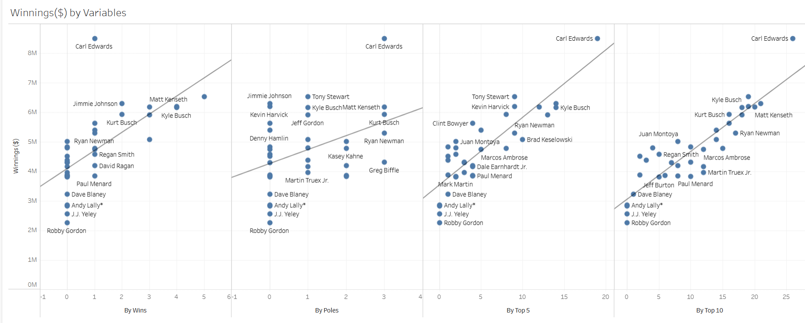

 NASCAR Driver Winnings Regression Analysis

## Project Overview
This project explores which performance factors most strongly influence NASCAR driver earnings. Using 2011 NASCAR performance data, I built a multiple linear regression model to predict driver winnings and visualized insights in Tableau.

## Goals
- Identify which performance metrics best predict driver earnings.
- Build a multiple regression model to estimate earnings.
- Create easy-to-understand visualizations to support team and business decision-making.

## Tools Used
- **Excel** — for regression modeling and variable engineering.
- **Tableau** — for interactive dashboards and data visualization.

## Key Steps
1. **Data Preparation**
   - Cleaned and formatted 2011 NASCAR data.
   - Engineered new features: _Top 2–5 Finishes_ and _Top 6–10 Finishes_.
2. **Regression Modeling**
   - Built a multiple linear regression model in Excel.
   - Evaluated statistical significance and adjusted variables for model clarity.
3. **Insights**
   - Found that _Top 10 finishes_ and _Wins_ were the strongest predictors of earnings.
   - Visualized trends to help stakeholders understand driver performance and earnings patterns.

## Example Visuals

## Key Takeaways
- Data-driven models can identify meaningful patterns in performance-based compensation.
- Feature engineering improved model accuracy and interpretability.
- Visualization made complex regression results accessible to non-technical audiences.
